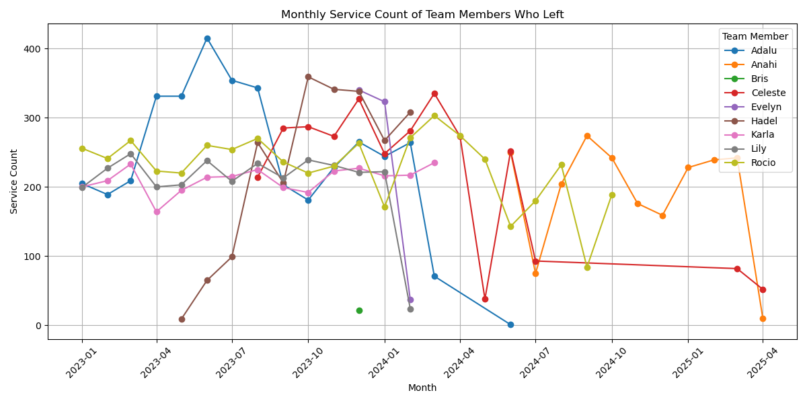
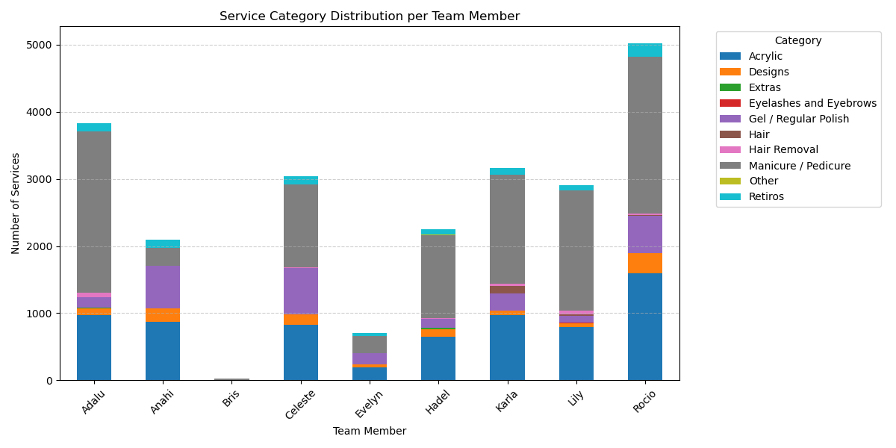
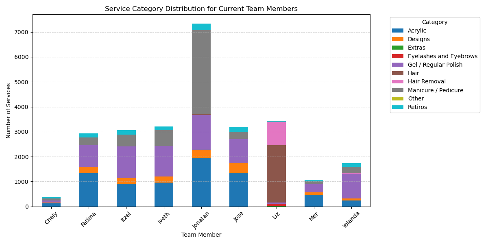

# Zela Nails: Team Member Turnover Analysis & Risk Monitoring Dashboard

---

## 📌 Project Overview

This project is a full-stack interactive dashboard designed for **Zela Nails**, a real nail salon based in Mexico that has experienced high team member turnover. The goal is to help the business understand **why employees leave**, and build a **risk monitoring system** that provides early warnings for future staff attrition.

The dashboard combines data-driven analysis, insightful visualizations, and a backend Flask API with a dynamic frontend interface.

---

## 💡 Introduction: Business Question & Motivation

Zela Nails noticed frequent resignations and inconsistent team performance. The main business question was:

> "Can we identify patterns in employee behavior before they leave?"

The motivation behind this project is to use historical sales data to:

- Understand **why** employees left
- Determine **common risk traits**
- Proactively flag current employees who may be at risk of leaving

---

## 🎯 Project Goals

1. **Analyze the behavior of team members who left** ("leavers")
2. **Compare them to current employees** to detect risk patterns
3. **Develop a scoring system** to monitor current team members based on:
   - Monthly drop in service volume
   - Specialization (lack of category variety)
   - Client retention ratios (total\_appointments / unique\_clients)
   - Heavy reliance on one category (Manicure/Pedicure)
4. Visualize all findings in a modern, filterable dashboard

---

## ⚙️ Usage & Installation Instructions

### Prerequisites

- Python 3.10+
- SQLite (data is stored locally)

### Installation

Clone the repo and run:

```bash
pip install -r requirements.txt
```

### Start the App

```bash
flask run
```

Then visit: `http://127.0.0.1:5000/`

---

## 📁 Project Structure

```text
zela-sales-dashboard/
│
├── app.py                         # Main Flask application
├── create_db.py                   # Script to import CSV into SQLite DB
├── requirements.txt               # Python dependencies
├── README.md                      # Project documentation
├── team_member_exit_analysis.ipynb # Jupyter notebook for deeper data analysis
├── zela_nails.sqlite              # SQLite database file
│
├── data/
│   └── Zela_Nails_Sales_Data.csv  # Original sales dataset
│
├── static/
│   ├── css/
│   │   └── style.css              # Dashboard styles
│   ├── js/
│   │   └── script.js              # Frontend logic and chart rendering
│   └── logo.png                   # Zela Nails logo
│
├── templates/
│   └── index.html                 # HTML template for dashboard UI
│
├── png/
│   └── *.png                      # Screenshots and data visualizations
```


---

## 🗃️ Data Preprocessing & Gathering

- **Source:** Actual sales data provided by the Zela Nails owner, with all sensitive personal information removed
- Cleaned and standardized category names
- Grouped and aggregated data for:
  - Monthly service counts
  - Category distributions
  - Client visits per employee

---

## 📈 Analysis & Logic

To identify traits linked with employee exits, we performed the following analyses, each of which contributed to our risk scoring system:

####  Monthly Service Trend Analysis
- We examined each team member’s service volume over time to detect warning signs of burnout or disengagement.
- A significant drop in monthly services—often greater than 30% compared to their average—was observed in many leavers.
- This drop pattern was used as a key flag in our risk scoring model to highlight potential attrition risk.

####  Monthly Service Count
- We calculated each team member’s average monthly service volume.
- If a team member consistently exceeds **300 services per month**, they are flagged for potential **burnout risk** due to overbooking.

####  Client Retention Ratio
- Defined as `total_appointments / unique_clients`
- A **low ratio (< 1.5)** may indicate weak client relationships.
- A **high ratio (> 2.6)** may signal that the employee has a loyal base and might be preparing to leave with clients.

####  Category Dominance Check
- We examined each team member’s service mix.
- If **Manicure/Pedicure** accounts for over 50% of their services, we flag it as a risk factor tied to specialization fatigue, lower creativity, or limited career growth.

---

## 📊 Visuals & Explanations

This dashboard was built using Flask and JavaScript to create a responsive, interactive experience for salon managers. It includes both high-level KPIs and granular drilldowns for client and team insights.

Each chart in the dashboard is powered by JS and populated via Flask API:

- **KPI Boxes:** Total Sales, Number of Sales, Avg. Sale per Customer
- **Line Chart:** Daily sales for selected month
- **Bar Chart:** Monthly sales for selected year
- **Horizontal Bar:** Top 5 team members by sales (sortable by volume or service count)
- **Client Table:** Top clients and ability to view visit history
- **Donut Chart:** Appointment channel breakdown
- **Category Bar Chart:** Sales by service type
- **Risk Monitor:** Flags high-risk employees with reasoning

---

## 🧠 Additional Logic Example (Python Snippet)

```python
# Risk score calculation logic
score = 0

# Check for client retention extremes (disengagement or poaching risk)
if retention < 2.0 or retention > 2.6:
    score += 1

# Drop in service volume (burnout indicator)
if drop_pct > 30:
    score += 1

# Over-specialization in Manicure/Pedicure
if mani_ratio > 0.5:
    score += 1

# High monthly service volume (risk of burnout)
if avg_volume > 300:
    score += 1

# Determine risk level based on total score
level = "High" if score >= 3 else "Medium" if score >= 1 else "Low"
```

---

### 🖱️ Interactive Features

- Clicking a **client name** in the Top Clients table opens a modal showing their **entire visit history**, including date, service, provider, and spend.
- The **Top Team Members** section includes a dropdown to sort by either **sales amount** or **number of services**.
- Dropdown filters allow management to switch between **branch, year, and month** — the dashboard updates in real-time.

---

## 📌 Major Findings

### 📉 Monthly Service Trends



- Several team members, such as Evelyn and Adalu, showed **significant drop-offs** in monthly service volume prior to leaving.
- These declines are early signals of burnout or disengagement.

### 📊 Service Category Specialization



_Service category distribution for former team members_



_Service category distribution for current team members_

- Most leavers had **Manicure/Pedicure** as their dominant category.
- Possible reasons:
  - **Entry-Level Track:** Often the first service new hires are trained on
  - **Low Variety:** Lack of creative or skill development opportunities
  - **Lower Pay Potential:** May earn less per hour than higher-skill services

### 🤝 Client Retention Ratio

- Team members with **retention ratio < 1.5** often had **weak client bonds** → possibly due to fit or service quality.
- Team members with **retention ratio > 2.6** were **highly valued** and possibly **poised to go independent**, taking clients with them.

---

- Most employees who left had:
  - A noticeable **drop in service volume** 1–2 months before exit
  - A strong bias toward **Manicure/Pedicure services only**
  - **Low or extremely high retention ratios**, indicating either weak client bonds or intent to leave with clientele
- Current team is more balanced — but some show early risk signs

---

## ⚠️ Limitations & Future Development

- The dataset does **not contain a direct indicator** of whether an employee is current or former. To address this, a **hardcoded list** of names was used to identify team members who had left. Ideally, this should be **dynamically tracked** via a status field in the database.
- The current risk model is **heuristic**, not machine-learned, which means it relies on rule-based thresholds rather than predictive algorithms.
- **Employee feedback and internal HR data** (e.g., schedule changes, complaints, tenure) are not yet included, limiting behavioral context.
- **External factors** such as pay scale, promotions, or life events are not captured but could influence turnover.
- **No continuous auto-refresh or alerts** — risk flags must be manually reviewed in the dashboard.

### Future improvements:
- Add login/authentication for manager view
- Allow manual annotation of high-risk employees
- Use ML to predict turnover probability
- Track and store employee status dynamically (e.g., onboarding, active, former)
- Integrate scheduling or HR data for deeper behavioral insights

---

## 💼 Business Impact

The Risk Monitor helps Zela Nails take **proactive action** to reduce costly turnover. By catching red flags early, management can:

- Check in with at-risk staff
- Offer training or support to improve variety and engagement
- Avoid operational disruptions and client dissatisfaction

This data-driven system turns historical patterns into actionable insights for **retention strategy**.

---

## 🧑‍💻 About the Team

This project was a team collaboration built by:

- **Dagim Girma**: Led the project vision and data analysis. Developed the risk monitoring logic, conducted exploratory analysis, and helped build frontend components.
- **Tiya Francy**: Contributed significantly to the backend Flask API routes and also assisted with frontend JavaScript chart integration.
- **Francisco Gonzalez**: Focused on data cleaning, analytical logic, and frontend UI design, using **Bootstrap and custom CSS** to make the dashboard visually appealing and responsive.

Technologies used:

- **Python** for backend data processing
- **Flask** for API routing and server setup
- **SQLite** as a lightweight data storage engine
- **JavaScript + Chart.js** for dynamic and modern chart rendering
- **Bootstrap** for a clean and responsive UI

---

## ✅ Conclusion

This project gives Zela Nails a **clear, visual, and data-backed way** to understand staff turnover. By flagging at-risk employees early, the business can take **proactive steps** to retain talent and improve team satisfaction.

---

## 📷 Screenshots

### 📌 KPI Boxes

_Display total sales, number of services, and average sale value._

### 📈 Sales Charts

_Daily and monthly sales trends visualized using line and bar charts._

### 👥 Top Members and Clients

_Displays top-performing team members, clients by total sales and doughnut chart showing appointment booking channels ._

### 📜 Pop-up Client History

_Displays all past visits by client, including services, team member, and amount spent._

### 📊 Category & Risk Monitor

_Shows category sales chart and risk levels assigned to team members._

---

## 🌟 Google Reviews Integration

At the bottom of the dashboard, a widget displays **live Google Reviews** for Zela Nails. This provides:

- Real-time customer feedback
- A quick snapshot of client satisfaction
- Added social proof for the business

The integration is handled using the Elfsight platform and seamlessly embeds into the dashboard interface.


---

## 📚 References

- Dataset: Internal Zela Nails operational data
- Icons/Designs: Bootstrap, Chart.js, Plotly
- Logic Inspired by: HR analytics turnover research from Kaggle case studies


